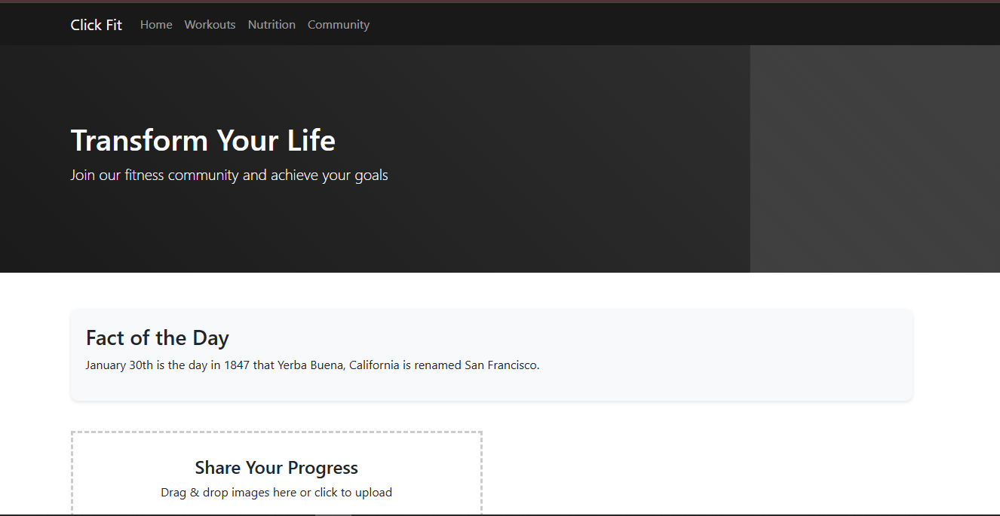

# Click Fit

Click Fit is a sports and fitness web application that allows users to display fun facts about dates and upload images via an interactive user interface.

## 🚀 Features
- Responsive UI with animations using CSS and Bootstrap
- AJAX request to an external API (`http://numbersapi.com/1/30/date?json`)
- Drag & Drop image upload with Node.js and Multer
- Backend built with Node.js and Express.js
- Local image storage (no cloud solution)
- MySQL database with user management

---

## 📂 Project Structure

```
click-fit/
│── backend/
│   ├── uploads/               # Folder for uploaded images
│   ├── db/
│   │   ├── database.sql       # SQL script to create the `users` table
│   │   ├── connection.js      # MySQL connection
│   │   ├── procedures.sql     # Stored procedures
│   ├── routes/
│   │   ├── upload.js          # Route for image uploads
│   │   ├── user.js            # Route for user management
│   ├── server.js              # Main Node.js server
│── frontend/
│   ├── scripts/
│   │   ├── script.js       # JavaScript (AJAX, interactions)
│   │── styles/   
│   │    ├── css/style.css      # CSS styles 
│   ├── index.html             # Main page             
│── README.md                  # Project documentation
```

---

## 🛠️ Installation and Setup

### 1️⃣ Prerequisites
- **Node.js** (v16+ recommended)
- **MySQL** installed on your machine

### 2️⃣ Clone the Project
```sh
git clone https://github.com/BOUARGALNE/click-fit.git
cd click-fit
```

### 3️⃣ Install the Backend
```sh
cd backend
npm install
```

### 4️⃣ Set Up MySQL
Run the SQL scripts in MySQL:
```sh
mysql -u root -p < backend/db/database.sql
mysql -u root -p < backend/db/procedures.sql
```

### 5️⃣ Start the Node.js Server
```sh
cd backend
node server.js
```
The backend runs on **http://localhost:5000**

### 6️⃣ Run the Frontend
Open `frontend/index.html` in a browser.

---

## 📌 API and Endpoints

### **Image Upload**
- **POST** `/api/upload`  
  - **Parameter:** `image` (file)
  - **Response:** `{ message: "Upload successful", file: "filename.jpg" }`

### **Add a User**
- **POST** `/api/user/add`
  - **Body:** `{ "email": "test@example.com", "password": "1234", "type": "standard" }`
  - **Response:** `{ message: "User added successfully" }`

---

🎨 UI Preview

Here is a preview of the Click Fit user interface:



💡 **Developed by Hamid Bouargalne** 🚀